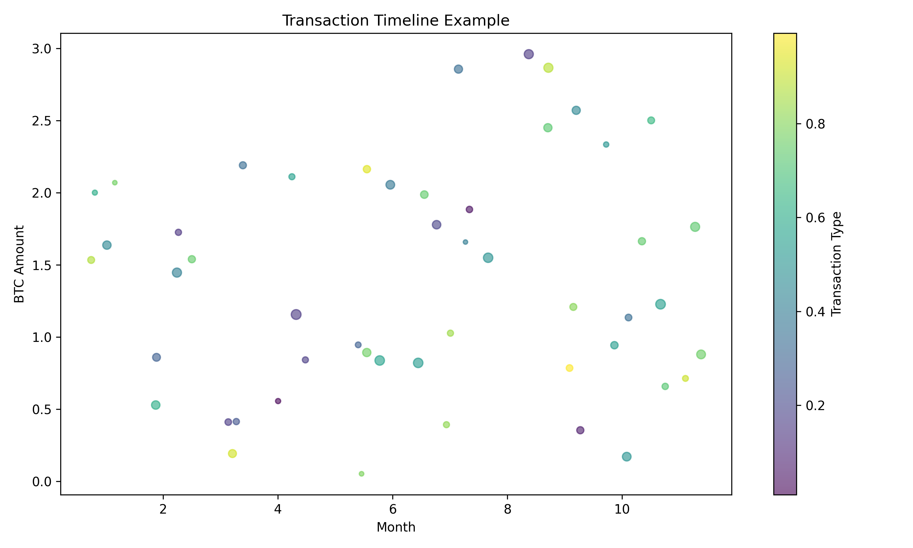
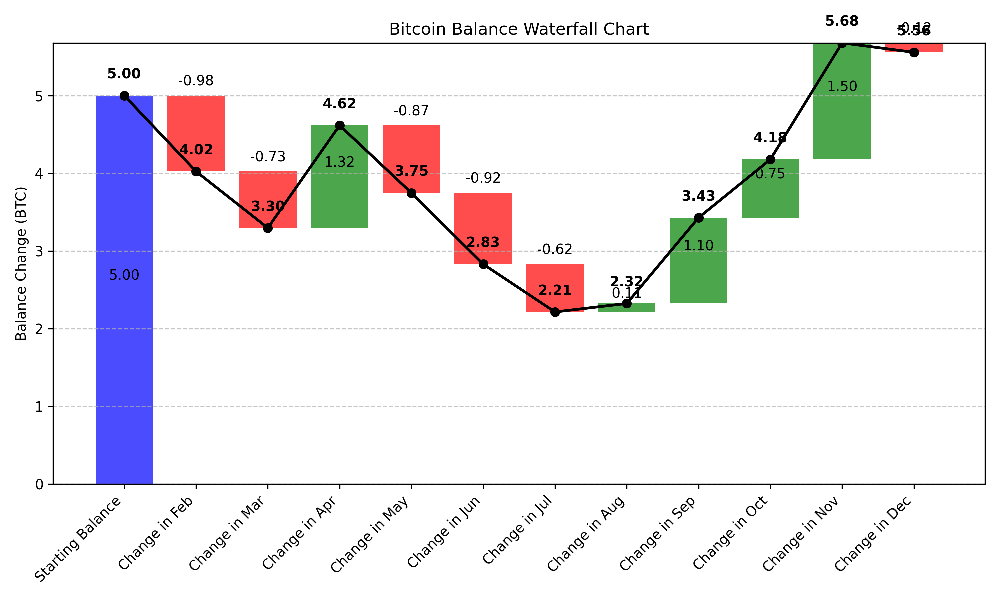

# Bitcoin Transaction Generator

A Python script to generate realistic Bitcoin transaction test data on regtest for multi-wallet accounting reconciliation testing.

## Overview

This tool generates a set of interdependent Bitcoin transactions that simulate real-world wallet usage across multiple wallets, including:

1. **Invoicing Wallet (xpub A)**: Receives 10,000 transactions over 12 months with USD values between $100-$2000
2. **Treasury Wallet (xpub B)**: Contains ~100 UTXOs from bi-monthly consolidations from xpub A
3. **Checking Wallet (xpub C)**: Receives 1 BTC from treasury and makes 20 outgoing payments

The generated data includes transaction dates, block heights, USD values, and proper UTXO dependencies to create a realistic simulation.

## Visualization Examples

The project includes visualization tools to analyze the generated transaction data:

### Sankey Diagram - Bitcoin Flow Between Wallets


### Transaction Timeline


### Wallet Balance Waterfall


### Total Bitcoin Balance Over Time


### Transaction Network


### Bitcoin Balance Waterfall Chart


## Requirements

- Python 3.7+
- python-bitcoinlib
- bitcoinrpc
- numpy
- pycoin (optional, for future improvements)
- For visualizations: plotly, pandas, networkx, matplotlib

## Installation

Clone the repository and install the required packages:

```bash
# Create virtual environment
python3 -m venv venv
source venv/bin/activate

# Install dependencies
pip install python-bitcoinlib bitcoinrpc numpy pycoin requests
pip install plotly pandas networkx matplotlib
```

## Usage

Generate transaction data:

```bash
python txgen.py
```

Create visualizations:

```bash
python visualize.py
```

### Transaction Generation Steps
1. Generate three wallets (Invoicing, Treasury, and Checking)
2. Create 10,000 invoice transactions for the Invoicing wallet
3. Generate bi-monthly consolidation transactions to the Treasury wallet
4. Create transactions between Treasury and Checking wallets
5. Add special larger transactions in/out of Treasury
6. Save all data to the `data` directory

### Visualization Types
- **Sankey Diagram**: Shows the flow of funds between wallets
- **Transaction Timeline**: Displays transactions over time with size indicating amount
- **Wallet Balance Waterfall**: Shows how balances change over time in each wallet
- **Total Balance Chart**: Displays combined balance of all wallets over time
- **Transaction Network**: Network graph showing interconnection between wallets
- **Bitcoin Balance Waterfall**: Displays incremental changes to balance with positive/negative indicators

## Output

The script generates several JSON files in the `data` directory:

- `wallets.json`: Information about the three wallets
- `exchange_rates.json`: Daily BTC/USD exchange rates for 2024
- `invoice_transactions.json`: 10,000 invoice transactions
- `consolidation_transactions.json`: ~100 consolidation transactions
- `checking_transactions.json`: Checking wallet transactions
- `special_treasury_transactions.json`: Special large transactions
- `all_transactions.json`: All transactions in chronological order
- `summary.json`: Summary statistics for the generated data

Visualizations are created in the `visualizations` directory as interactive HTML files.

## Future Improvements

- Integration with actual Bitcoin Core regtest node
- Generation of actual on-chain transactions
- Support for more complex transaction patterns
- Export to formats compatible with various accounting tools

## License

MIT - Copyright (c) 2025 nvk --vibing 